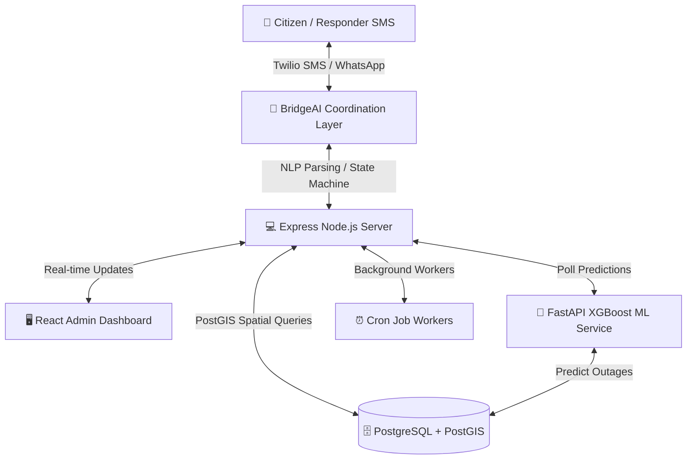

# ARIA — Automated Response and Intelligence Agent

ARIA is a unified, real-time crisis management and disaster response platform designed to coordinate relief, route citizens safely, sequences power restoration, and track donations across all phases of a crisis.

---

## 🏛️ Platform Architecture



---

## 🚀 Key Modules

### 1. StormPath (Citizen-Facing)
*   **Safe Pathfinding**: Dijkstra pathfinder that penalizes roads based on active hazard decay rates (ice, debris, trees).
*   **Interactive Mobile App**: Scaffolding for onboarding, OTP login, and a need-request grid.
*   **Welfare Verification**: Upgrades user trust tiers via progressive ID upload and selfie biometric verification.
*   **Progressive Address Disclosure**: Hides helper addresses until a volunteer accepts the delivery route, protecting citizen privacy.

### 2. CrewIQ (Responder-Facing)
*   **Sequenced Dispatching**: Smart sequencing rules (e.g., dispatching tree-clearing crews to remove debris *before* sending electrical crews to restore downed power lines).
*   **Outage Priority Scorer**: Priority queue calculated from canopy density, circuit age, hospital proximity, and ice accumulation.

### 3. BridgeAI Agent (Coordination Layer)
*   **Intent Extraction**: Extracts category, urgency, location, and metadata using a local regex keyword classifier with an automated fallback to the Anthropic Claude API.
*   **Bipartite Matcher**: Matches open needs with helper resource offers using a weighted proximity/trust/urgency matrix.
*   **Two-Way State Machine**: Handles inbound SMS triggers (`YES`, `NO`, `GO`, `ARRIVED`, `DONE`, `CANCEL`) to advance workflow stages in real-time.

---

## 📂 Project Structure

```
ARIA/
├── server/             # TypeScript Express Backend, Sockets, & Cron Jobs
├── ml-service/         # Python FastAPI XGBoost Outage Prediction Service
├── web/                # Vite + React + Tailwind + Leaflet Admin Dashboard
├── mobile/             # Expo React Native Citizen/Responder Mobile App
├── database/           # PostGIS schema.sql and seed.sql files
└── README.md           # System documentation
```

---

## 🔧 Getting Started & Installation

### 1. Database Setup (Postgres + PostGIS)
1. Ensure PostgreSQL 18 and PostGIS are running locally on port `5432` with database name `aria`.
2. Navigate to `server/` and run the migration script to configure database schemas and seed datasets:
   ```bash
   cd server
   npm install
   npm run setup-db
   ```

### 2. Run Backend Server (Express + Socket.io + Cron Workers)
1. Run the developer node server:
   ```bash
   cd server
   npm run dev
   ```
   *The server boots on port `3000` and starts the background cron workers (decaying hazards, scoring circuits, auto-routing expired food, and running Ghost Mode welfare scans).*

### 3. Run ML Prediction Service (FastAPI + XGBoost)
1. Navigate to the ML directory, set up the virtual environment, install dependencies, train the model, and launch the service:
   ```bash
   cd ml-service
   python3 -m venv .venv
   source .venv/bin/activate
   pip install -r requirements.txt
   python model/train.py
   python main.py
   ```
   *The ML service boots on port `8000`. It feeds XGBoost circuit failure probabilities to the backend dashboard.*

### 4. Run Admin Dashboard (React Vite)
1. Navigate to the web folder, install packages, and boot the web dev server:
   ```bash
   cd web
   npm install
   npm run dev
   ```
   *The Vite dashboard starts on [http://localhost:5173](http://localhost:5173).*

### 5. Run Mobile App Scaffold (Expo React Native)
1. Open and build the React Native screens:
   ```bash
   cd mobile
   npm install
   npx expo start
   ```

---

## 🎬 Testing the Demo Simulation
You can trigger the automated 3-story crisis scenario (involving storm impacts, aid matching, volunteer dispatches, and outage sequence resolutions) by querying the simulation runner:
```bash
# Trigger the simulation
curl -X POST http://localhost:3000/api/demo/run

# View database metrics & resolution statistics
curl -s http://localhost:3000/api/stats

# Reset the transactional database to clean status
curl -X POST http://localhost:3000/api/demo/reset
```
